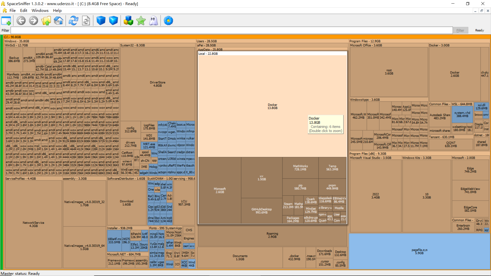

# [MathModelAgent](https://github.com/jihe520/MathModelAgent) 自动部署脚本 README

欢迎体验 MathModelAgent 的自动化部署！本 README 是你的部署指南，助你快速上手这款数学建模利器。**警告**：先读后操作，路径错误后果自负！😉

## 更新日志

### 新功能

- **全新上线：`auto_setup_run_docker.bat`！** 放入 MathModelAgent 根目录，双击运行，Docker 自动完成部署！但注意，务必仔细阅读本 README 避免踩坑！🚨

### 移除

- 移除 `auto_setup_run_win_and_mac` 脚本，因其功能未经验证。

### 运行 auto_setup_ruan_docker 的前置条件（必读）

- **后端 `.env.dev` 配置**：Docker 部署前必须手动配置 `.env.dev`，这是第一步，跳过必翻车！
- **Docker Desktop**：需安装、运行并登录。没有 Docker？直接无缘部署！
- **代理**：建议使用代理以确保网络畅通。
- **镜像源**：必须配置国内镜像源，避免 VPN 冲突或认证问题。

**提示**：`auto_setup_run_docker.bat` 会尝试配置镜像源，但可能需在 Docker Desktop 的 `Docker Engine` 界面手动点击 `Apply & Restart` 生效。

### 推荐部署流程

**参考资料**：

- [Windows | Docker Docs](https://docs.docker.com/desktop/setup/install/windows-install/)
- [如何优雅地变更 Docker Desktop 的镜像存储路径](https://cloud.tencent.com/developer/article/2414097)
- [新版本 Docker Desktop 自定义安装路径和镜像地址修改](https://blog.csdn.net/hx2019626/article/details/145140014)

按以下步骤操作，确保部署顺畅：

1. **配置后端 `.env.dev`**：
   
   - 复制 `backend\.env.dev.example` 为 `backend\.env.dev`。
   - 编辑 `backend\.env.dev`，配置以下关键项（参考下图示例）：
     - `REDIS_URL`：Docker 使用 `redis://redis:6379/0`，本地使用 `redis://localhost:6379/0`。
     - 模型和 API 密钥：如 `COORDINATOR_MODEL`, `COORDINATOR_API_KEY`, `MODELER_MODEL`, `MODELER_API_KEY` 等。
     - 参考 [LiteLLM 文档](https://docs.litellm.ai/docs/) 获取模型选项。
   - 示例配置：
     
   
2. **安装 Docker Desktop**：
   - 指定安装和资源路径，避免占满 C 盘。示例命令（路径可自定义）：
     ```bash
     start /w "" "Docker Desktop Installer.exe" install --accept-license --installation-dir="E:\Docker\Docker"
     ```
   - 在 Docker Desktop 的 `设置 > 资源` 中设置存储路径，节省空间：
     

3. **配置镜像源**：
   - 编辑 `%USERPROFILE%\.docker\daemon.json` 或在 Docker Desktop 的 `设置 > Docker Engine` 中粘贴以下配置，加速镜像拉取：
     ```json
     {
       "builder": {
         "gc": {
           "defaultKeepStorage": "20GB",
           "enabled": true
         }
       },
       "experimental": false,
       "registry-mirrors": [
         "https://docker.1ms.run",
         "https://docker.xuanyuan.me",
         "https://hub.rat.dev",
         "https://dislabaiot.xyz",
         "https://doublezonline.cloud",
         "https://xdark.top"
       ]
     }
     ```
     

4. **运行自动部署脚本**：
   - 将 `auto_setup_run_docker.bat` 放入 MathModelAgent 根目录，双击执行。脚本会：
     - 检查 Docker 是否运行。
     - 配置镜像源（若未配置）。
     - 设置环境变量。
     - 通过 Docker Compose 启动服务。
   - **示例输出**：
     ```
     Checking if Docker is installed and running...
     Docker version 28.1.1, build 4eba377
     Verifying project directory...
     Configuring Docker registry mirror...
     daemon.json already exists. Please ensure it contains valid registry mirrors
     Configuring environment variables...
         1 file(s) copied.
     Copied backend\.env.dev.example to backend\.env.dev. Adding local Redis comment...
     
     ************************************************************
     *                      WARNING                             *
     ************************************************************
     * To run MathModelAgent, you MUST configure the following: *
     * 1. Redis URL:                                            *
     *    - For Docker: REDIS_URL=redis://redis:6379/0          *
     *    - For local: REDIS_URL=redis://localhost:6379/0       *
     * 2. Model and API Key settings in backend\.env.dev:       *
     *    - COORDINATOR_MODEL and COORDINATOR_API_KEY           *
     *    - MODELER_MODEL and MODELER_API_KEY                   *
     *    - CODER_MODEL and CODER_API_KEY                       *
     *    - WRITER_MODEL and WRITER_API_KEY                     *
     *    - DEFAULT_MODEL and DEFAULT_API_KEY                   *
     * Refer to https://docs.litellm.ai/docs/ for model options.*
     *                                                          *
     * Please edit backend\.env.dev and rerun this script.      *
     ************************************************************
     
         1 file(s) copied.
     Copied frontend\.env.example to frontend\.env.development. Please edit the configuration
     Stopping and removing existing containers if any...
     Note: Data is persisted in volumes and will not be lost when containers are removed.
     Removing existing containers if they exist...
     Starting Docker Compose services...
     [+] Running 8/8
     
     ...
     
     Services started successfully
     Frontend: http://localhost:5173
     Backend API: http://localhost:8000
     Press any key to exit...
     ```
   - 关闭命令行窗口。

5. **docker container运行MMA**：
   - 访问前端，MathModelAgent 即可使用！

> **提示**：若未安装 buildx，构建可能极慢。建议从 [Docker buildx v0.24.0](https://github.com/docker/buildx/releases/tag/v0.24.0) 下载 `buildx-v0.24.0.windows-amd64.exe`（或根据系统选择版本）：
>
> - 移动至 `%USERPROFILE%\.docker\cli-plugins`（若无此文件夹则创建）。
> - 重命名为 `docker-buildx.exe`。
> - 在命令行验证：
>   ```
>   C:\Users\YourUser>docker buildx version
>   github.com/docker/buildx v0.24.0 d0e5e86c8b88ae4865040bc96917c338f4dd673c
>   ```

### 常见问题（避坑指南）

**错误做法**：直接双击 `Docker Desktop Installer.exe` 默认安装。

- **问题**：
  - 默认安装将 Docker 文件和镜像存储在 `%USERPROFILE%\AppData\Local\Docker\wsl\`，C 盘空间告急！
  - 未配置镜像源，导致拉取镜像缓慢或失败。
- **解决办法**：按推荐流程操作，指定安装路径并配置镜像源。

### 资源管理（保护你的硬盘）

- **存储占用**：部署约需 14GB 后续如果有其他镜像，会更大...，默认存储在 `%USERPROFILE%\AppData\Local\Docker\wsl\`。
  

- **空间清理**：硬盘空间不足时，运行以下命令：
  
  ```bash
  docker system prune -a
  docker volume prune
  ```
  
- **优化存储**：
  1. 在 Docker Desktop 的 `设置 > 资源` 修改存储路径。
  2. 高级操作：重启电脑后运行 [DockerSetup.ps1](./收录脚本/DockerSetup.ps1)，通过符号链接迁移存储路径（谨慎操作，回滚复杂）。

## 脚本介绍（你的懒人神器）

  批处理脚本：`auto_setup_run_docker.bat`

  批处理脚本：`auto_setup_run.bat`

  批处理脚本：`start_mma.bat`

  批处理脚本：`start_mma_all_windows.bat`

  Python 脚本：`auto_setup_run_win.py`

## 项目输出（你的劳动成果）

服务跑起来后，成果文件都乖乖躺在 `backend/project/work_dir/xxx/`（如果是docker则需要在docker容器里面查看，一看就懂啦！）
- `notebook.ipynb`：代码神器，拿去跑模型！
- `res.md`：Markdown 格式结果，简洁又好看。
- `res.docx`：带图的 Word 文档...